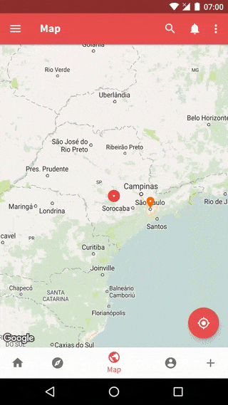

<!-- markdown-preview README.md -->
# BottomSheetCoordinatorLayout

```groovy
implementation 'com.otaliastudios:bottomsheetcoordinatorlayout:1.0.2'
```

A handy `CoordinatorLayout` that works well when used in a bottom sheet, even with `AppBarLayout`s inside.

<p align="center">
  
</p>

## Usage

Just use `BottomSheetCoordinatorLayout` as the root view of your bottom sheet. It will be automatically
given the right `BottomSheetBehavior`.

```xml
<com.otaliastudios.bottomsheetcoordinatorlayout.BottomSheetCoordinatorLayout
    android:layout_width="match_parent"
    android:layout_height="match_parent">
    
    <!-- AppBarLayout -->
    
    <!-- Everything else -->
    
</com.otaliastudios.bottomsheetcoordinatorlayout.BottomSheetCoordinatorLayout>
```

To get an instance of the behavior, use `bscl.getBehavior()`.
As usual with behaviors, the returned value might be null if the view has not gone through a layout,
so wait for that.

If you just want to set appropriate `BottomSheetCallback`, you can use `bscl.setBottomSheetCallback()`.
Callbacks will be added to the sheet behavior as soon as it is available, so this can be called safely
whenever you want.

## Contributing

You are welcome to contribute with issues, PRs or suggestions. To contact me, <a href="mailto:mat.iavarone@gmail.com">send an email.</a>